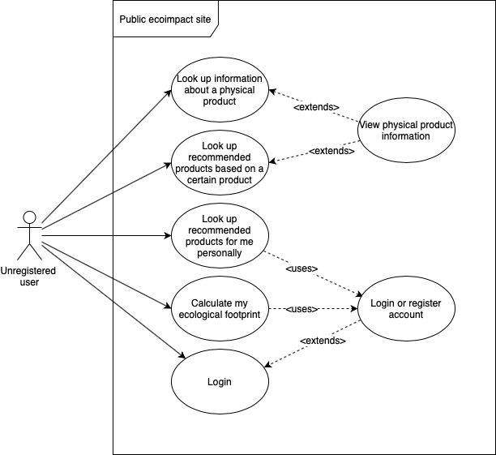
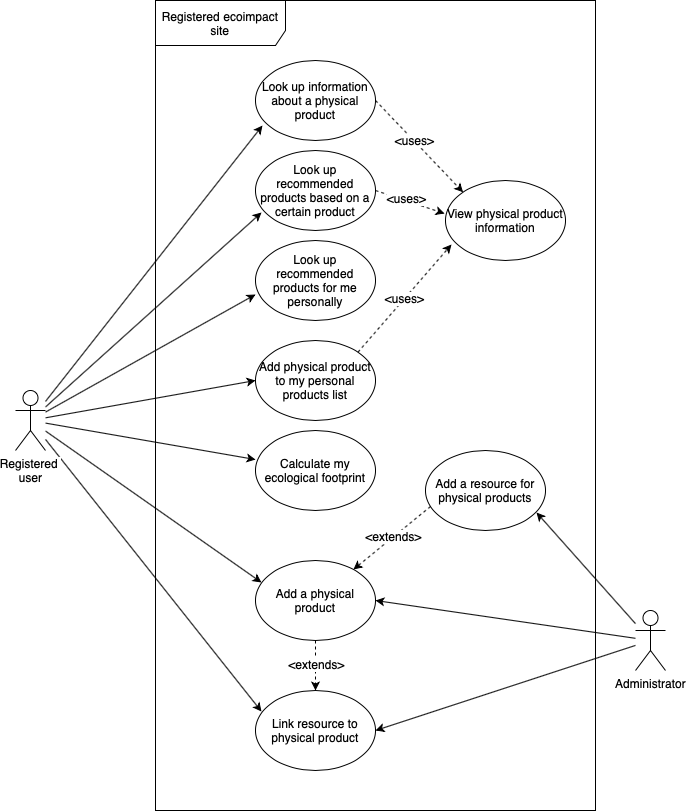

# Use cases

Let's define the main use cases for the application in order to get a bird's eye view over the required functionality.

## Public Eco-impact website

## Registered Eco-impact website

