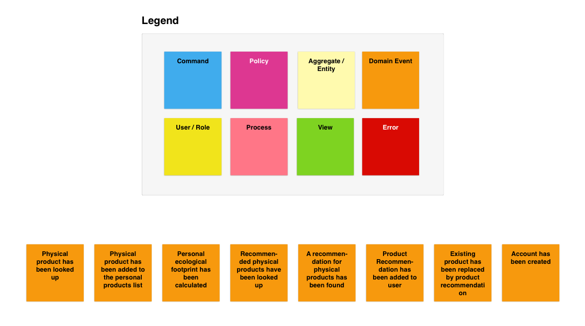
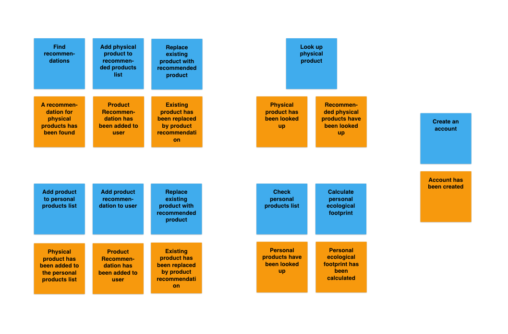
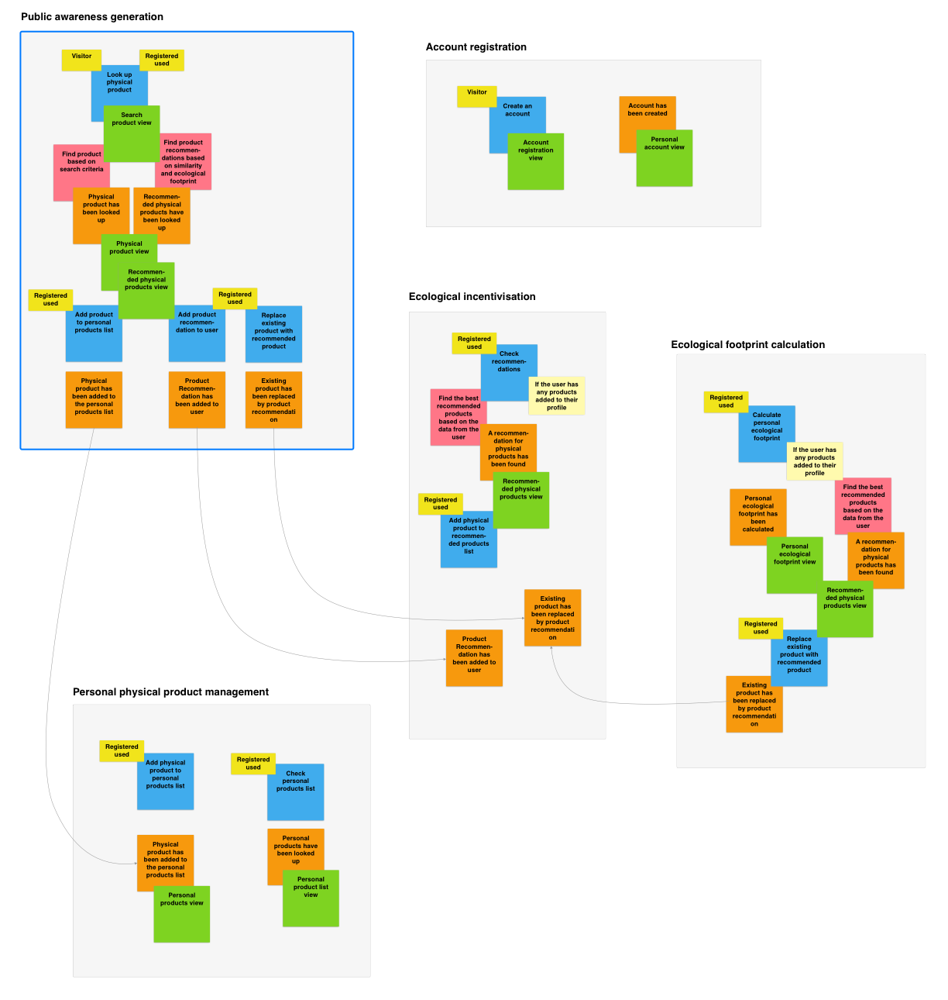

# Big Picture Event Storming

Let's explore the domain of the Eco Impact project through some brain storming. We will do this by simulating an Event Storming session. The goal is to create a business model that can be used during development.

## Open

## Explore

## Close

## DDD

### Domains (Ubiquitous Language)

A sphere of knowledge (ontology), influence, or activity. The subject area to which the user applies a program is the domain of the software. 

* Physical product
* Recommended physical product
* Ecological footprint
* Physical resource

###Domain Events (What happened?)

A domain object that defines an event (something that has happened, written in the past tense). A domain event is an event that domain experts care about.

* Physical product has been looked up
* Recommended physical products have been looked up
* Physical product has been added to the personal products list
* Personal products list has been looked up
* Product recommendation has been added to the user
* Exist product from the user has been replaced by the product recommendation
* A recommendation for a physical product has been found
* Personal ecological footprint has been calculated
* Account has been created

### Commands (Why did it happen?)

* Look up physical product
* Add product to personal products list
* Add product to recommended products list
* Replace existing product with recommended product
* Check personal product list
* Check personal product recommendation list
* Calculate personal ecological footprint
* Create an account

### Bounded Contexts

* Public awareness generation
* Ecological incentivization
* Ecological footprint calculation
* Personal physical product management
* User registration

### Views

* Search product view
* Physical product view
* Recommended physical products view
* Personal products view
* Personal ecological footprint view
* Account registration view
* Personal account view

**Resources**

* https://www.eventstorming.com
* https://en.wikipedia.org/wiki/Domain-driven_design
* https://eventnotes.io/pdf/cheatsheet-big-picture-exploration.pdf